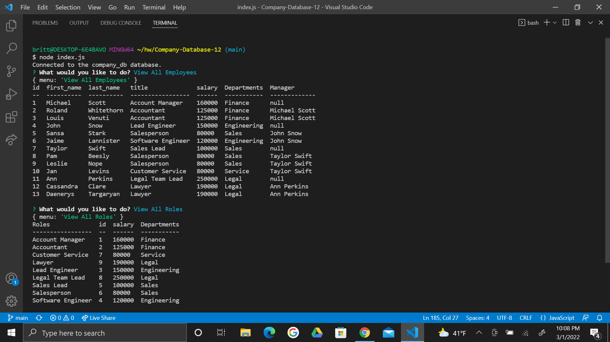

# Company-Database-12

  ## Description
This application provides a structured database for a sample company. Users can view various tables made with mysql such as the company's departments, current job roles, and employees directory. Users can also add new additions to departments, roles, and employees. This application is very user friendly and can easily help a company maintain an organized databse. 

  ## Table of Contents

* [Installation](#installation)
* [Usage](#usage)
* [License](#license)
* [Contributing](#contributing)
* [Tests](#tests)
* [Questions](#questions)

## Installation
To install this application go through the following steps. 
1. Open or clone the repository to VSC. 
2. Make sure you have the following installed to the terminal: inquirer, console.table, and mysql2.
3. Run node index.js. Then simply select what you want to do from the menu. 

## Usage
While running node index.js in the terminal you will be prompted to select what you want to do. From viewing departments and employees to adding new roles. If you want to add new fields for departments, roles, or employees you must input or select details for all the prompts. After each additon or viewing the user will be asked what they want to do next and be shown the same menu options to choose from. A visual example and video demo can be seen below for more help. 
 

Demo: https://drive.google.com/file/d/1FR4t7W4jol459Yst3KbmyvcDxxbv8dVm/view

## License
This application uses ISC license 

## Contributing
If you are looking to add a contribution to this project you can visit this site for information: [Contributor Covenant](https://www.contributor-covenant.org/)

## Tests
There are currently no tests to run on this application

## Questions

For any additional questions or issues, you can reach out to me 
via email at brittany.klose@yahoo.com
Otheriwise fee free to further view my work on my github page at [britt-klose](https://github.com/britt-klose/).